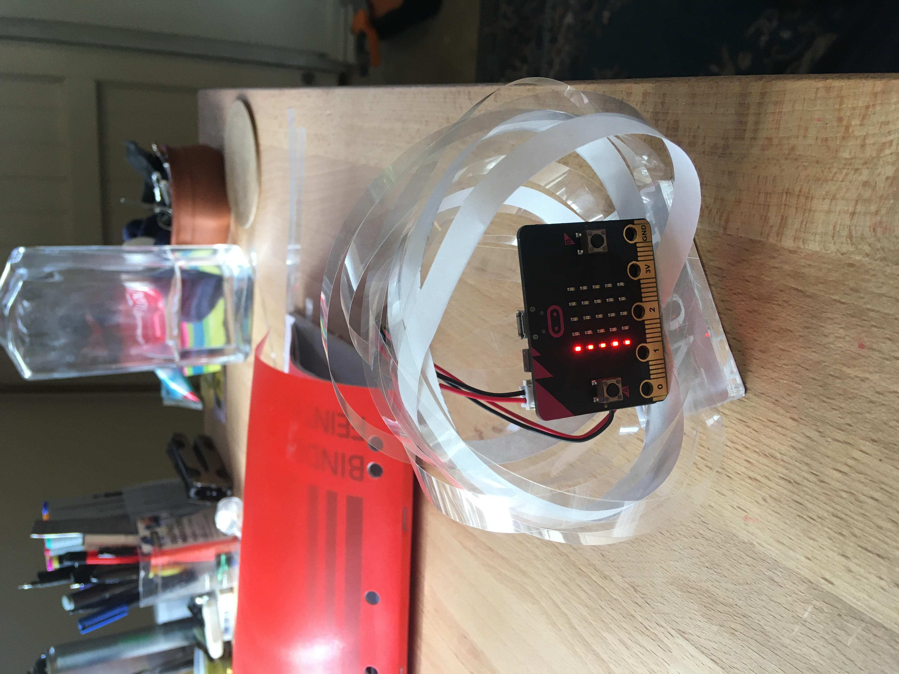

# 1701QCA Final project journal: *Insert your name here*

<!--- As for other assessments, fill out the following journal sections with information relevant to your project. --->

<!--- Markdown reference: https://guides.github.com/features/mastering-markdown/ --->

## Related projects ##
<!--- Find about 6 related projects to the project you choose. A project might be related through function, technology, materials, fabrication, concept, or code. Don't forget to place an image of the related project in the appropriate folder and insert the filename in the appropriate places below. Copy the markdown block of code below for each project you are showing. --->
### Related project 1 ###
#### Giant LED sign for $15/foot ####
Project url:[https://blog.arduino.cc/2016/06/29/a-giant-arduino-powered-scrolling-led-sign-costs-15foot/](https://blog.arduino.cc/2016/06/29/a-giant-arduino-powered-scrolling-led-sign-costs-15foot/)


This project is related to mine because its lighting system is very similar to the intended lighting set up that I will use. This project uses eight WS2812/Neopixel LED light strips that are stacked vertically and programmed to display text, my implementation of this sign will use the microbits 5 high LED resolution and will be about a meter long compared to this project which is about 7 meters long.

### Related project 2 ###
#### Jenny Holzer####

[https://blog.arduino.cc/2016/06/29/a-giant-arduino-powered-scrolling-led-sign-costs-15foot/](https://blog.arduino.cc/2016/06/29/a-giant-arduino-powered-scrolling-led-sign-costs-15foot/)

This project is related to mine because it uses the 

### Related project 3 ###
#### Moving No.3 Sculpture by Wenqin Chen ####
[https://www.saatchiart.com/art/Sculpture-Moving-No-3/40932/7029683/view](https://www.saatchiart.com/art/Sculpture-Moving-No-3/40932/7029683/view)


This project is related to mine because of it is similar aesthetic appearance. The artwork by Wenqin has a form familiar to my own project. The Artist has also used a reflective material, this is something that I have considered myself as well.  

### Car Heads Up Display ###

<!--- Modify code to insert image of related project below --->


<!--- Fill out name and link to related project in the code below. --->
Related product
[Car Heads up display](https://www.kogan.com/au/buy/obdii-car-head-display/)
Related project 
[Car Heads up display Arduino project ](https://lifehacker.com/how-to-build-a-heads-up-display-for-your-car-1129913775?IR=T)

<!--- Include information about why this project is related to yours. --->
The above projects are very similar to the functionality of the projected screen that is seen in my project. Neither of these links were used to inform the design but the inspiration was drawn from the knowledge this reflection effect. 

### *Sonar traffic lights* ###

<!--- Modify code to insert image of related project below --->


<!--- Fill out name and link to related project in the code below. --->
[https://www.kitronik.co.uk/blog/distance-sensing-microbit-hc-sr04-module](https://www.kitronik.co.uk/blog/distance-sensing-microbit-hc-sr04-module)

<!--- Include information about why this project is related to yours. --->
This project is related to mine because it uses the Ultrasonic distence sensor
<!--- Repeat code above for a total of 6 related projects --->


## Other research ##
<!--- Include here any other relevant research you have done. This might include identifying readings, tutorials, videos, technical documents, or other resources that have been helpful. For each particular source, add a comment or two about why it is relevant or what you have taken from it. You should include a reference or link to each of these resources. --->

### Inspiration ###
* [https://projects.jennyholzer.com/LEDs](https://projects.jennyholzer.com/LEDs)
* Jenny Holzer - This project inspired both the Initial Final design and the Final design. 
* [https://www.ntticc.or.jp/en/exhibitions/2011/mikami-seiko-desire-of-codes/](https://www.ntticc.or.jp/en/exhibitions/2011/mikami-seiko-desire-of-codes/)
* Seiko Mikami - This project inspired the first design concept.
* [Cut EVA Foam hat](https://www.google.com.au/url?sa=i&url=http%3A%2F%2Fpromowarehouse.co.za%2Ffunky-ideas%2Ffoam-peaks%2F&psig=AOvVaw2XkQemUaGCVPzjc2saEU4J&ust=1589838865665000&source=images&cd=vfe&ved=0CAkQjhxqFwoTCLDImrvxu-kCFQAAAAAdAAAAABAK)
* This foam hat was an inspiration to the design of the paper covering that enclosed the Micro:bit. This specific product did not inform the design but the knowledge of this design style did. 

### Functionality and Technical Research ###
#### Initial Final Concept ####
* [https://wp.josh.com/2016/05/20/huge-scrolling-arduino-led-sign/](https://wp.josh.com/2016/05/20/huge-scrolling-arduino-led-sign/)
* Josh Levine - Build blog of functional requirements of
* [https://core-electronics.com.au/5m-rgb-led-strip-ws2812-60-per-meter-black-strip-weatherproof.html](https://core-electronics.com.au/5m-rgb-led-strip-ws2812-60-per-meter-black-strip-weatherproof.html)
* Core electronics - to source parts and some tutorials 
[https://www.kitronik.co.uk/blog/distance-sensing-microbit-hc-sr04-module](https://www.kitronik.co.uk/blog/distance-sensing-microbit-hc-sr04-module)
* Micro:bit tutorial for the Ultrasonic distance sensor

#### Final Concept #### 
* [https://www.kitronik.co.uk/blog/distance-sensing-microbit-hc-sr04-module](https://www.kitronik.co.uk/blog/distance-sensing-microbit-hc-sr04-module)
* Micro:bit tutorial for the Ultrasonic distance sensor
 

## Conceptual development ##

### Design intent ###
<!--- Include your design intent here. It should be about a 10 word phrase/sentence. --->
Art installation that communicates ideas about living with technology.
### Design ideation ###
<!--- Document your ideation process. This will include the design concepts presented for assessment 2. You can copy and paste that information here. --->

### Design concept 1 ###
My first idea for an interactive that aligns with the design intent, was inspired by Seiko Mikami's *Desire of Codes* this interactive installation has a range of cameras that follow visitors recording them, this footage is projected onto a screen showing past and present visitors in a cool hexagonal visualization. My idea was to use the microbit to create a smart home device reminiscent of Google home/Alexa, the device would listen to people around it and then play back recording of what people have said around it. The device could even have some visual element to get people talking about it while they're nearby. 

One of the big dampeners on this idea is the limitations of the microbit. Its only a simple device with limited processing power and storage and has pretty limited functionality when it comes to audio. Due to the small storage size the melodies that it can play are short, only a few seconds and as fair as I am concerned there is no way to record sounds.
This combined with the intensive processing that would be required to trim audio clips and play them back puts the microbit in out of its depths. 

[Seiko Mikami's Desire of Codes](https://www.ntticc.or.jp/en/exhibitions/2011/mikami-seiko-desire-of-codes/)

### Design concept 2 ###
My second idea was focused around the infinite scroll user interface used by many of the most popular apps today. The human nature of how we are so easily captivated by this UI I find very interesting. From my own personal experience I've found my self captivated by a screen on many an odd occasion yet it is hard to resist; On the bus looking at the persons phone I front of me if I don't have my own, during a conversation even when I'm quite engaged in it, and when some ones instagram feed is in my field of view, all of these examples are just when I'm looking at others screens and not my own. So is it the swiping or the screen? This is an idea that I wanted to explore for the design intent. My idea to implement this would be screen similar to a phone with a similar UI to instagram of facebook however instead of showing a personalized catalogue of images they would be random or stock images. The purpose would be to see how and if people would engage with just a random feed. Would people scroll? How long for? Other interesting ideas for this project could be placing it at a free charging station to see if people would use it to substitute their phone.


### *Initial* final design concept  ###
The final design concept is a sculpture that displays text on an LED screen and that text changes as a person approaches and it detected by the sculpture. The LED screen will be the focal point of the sculpture as it will display a range of text strings with different messages; one standard loop and one for when someone is detected to be in front of the sculpture.  The sculpture will be used to provoke interest and attract people to engage in the interaction. 

#### Functionality ####
The technical functionality will vary in complexity the electronic implementation should be quite simple with only a range of LED strips and a sensor to be connected to the micro bit however, the coding side of the project will be quite intensive. 
The following is a wiring diagram 

#### Fabrication ####
At the current stage of the project much of the fabrication is still to be worked out. My current thinking is to get a long sheet of flexible plastic and bend it into the figure 8 style shape the led screen can then be glued onto this. In the image further down of the paper prototype hanging up the sculpture is supported by string this will likely be used to hang the final project as well. 

#### Aesthetics ####
The aesthetics of Jenny Holzers LEDS have been very inspirational in the conception of the project. With the first conception seeming quite reminiscent of some of her works. 
 
 The image above is a sketch of the original conception. The black text is the original imagining of how the project may look. The red text is the revision of the design having a smaller LED screen in the centre of the sculpture.  This decision was made to shorten the LED screen after researching the materials to use. It was quickly discovered after a few measurements of a paper prototype that a lot of LEDs will be needed and that it would be quite expensive to have lights running around the whole sculpture. 
It was calculated that the prototype was 336cm long and I intend on using a 5 high LED resolution like the micro bit so this would need 15 meters of LED strips. After looking on the Neopixel website it was found that even buying the cheapest strips (30LEDS/meter) would cost a whole $300+ and this is not feasible, so cutting the LED screen down to 1 meter means this project can be more affordable with almost the same aesthetic effect.
 
The paper prototype is shown above this was made very simply and was used to estimate the LED cost as well as getting a feel for how the whole thing will look, feel and work.

#### Interaction ####
At the early stage of development when I considered interaction, I was racking my head to think about how people could engage with this project as it was only text scrolling across the screen. I thought about the different triggers and interfaces that are available, starting with the ones that on board the microbit. However, I did not think of a suitable trigger in the inventor’s kit, I did think of using an ultrasonic distance sensor as it could detect people approaching the artwork to view it. At this point I had the epiphany to combine a LED strip of text with the figure 8 style shape and make it a sculpture. In incorporating the LED screen into the sculpture, I believe people will be drawn into the artwork and will approach it for a closer look. This then can trigger the interaction of the text changing state. Testing, iterating and experimenting will be required to find out if the interaction will actually be carried out. Designing a range of signifiers to signal appropriate action may be required. 

### Changes and Why ###
Briefly after the submitting of the Initial Design the next step was to start experimenting with materials for the loop and buy some other compensates. As the initial design came together it was much an image in my head instead of a fully realised project, I also had not endorsed into the fabrication very much. As a result of this when it came to buy all of the materials needed it was going to run up quite a bill. It was already known that the LEDs would be expensive but with all of the other needed material added (especially the plastic for the loop) it was not feasible to continue. At this point a couple of decisions had to be made I already had a few backup ideas for recreating the interaction with just the microbit so I experimented a little with mocking up these designs to get a feel for them. After doing this I decided on the new aesthetic form of the project and set about making this a reality.   


### Final design concept ###
<!--- This should be a description of your concept including its context, motivation, or other relevant information you used to decide on this concept. --->
The concept of the final design is for a nest like sculpture with an opening at the front that people can bend down and look through, what they will see is text relevant to the theme of living with technology. The project is be best suited for the context of an art gallery or exhibition as it quite delicate and is predominately designed for viewing. It also fits the installation/sculpture theme relevant to the design intent. One of the key motivations for the project was the ambition to create an engaging art piece, as this is an interest of mine. Another driving force behind the theme of the project is my interest in the relationship between people and their devices and technology. These days this relationship is both inescapable and ubiquitous it intrigues me. 

#### Functionality ####
The functional requirements for the project are quite basic and can be simplified to two key sections. 
Microbit requirements
* Receive sonar data from Ultrasonic
* Process logic (If 'reading' < 7 )
* Display text (Actually images to the M:B)

Power requirements 

* Power Microbit 
* Power Ultrasonic sensor

When combined the whole system should monitor if something is close to the sensor and trigger accordingly. 

#### Fabrication ####
As for fabrication I will start with what is known and create around this. Much of the fabrication of the project will be done by thinking through making and prototyping. From here the look of the project start to be built up as well. So, what is known, the 5x5 microbit screen will show the text and the ultrasonic will be looking forward to sense people. The overall size of the project will be no bigger than an A4 sheet and most of the materials will be source from what I already have. 

#### Aesthetics ####
There have been a few major influences in the aesthetic choices made the first being Jenny Holzer and her LED artworks these works utilize LED strips of text in various forms to make a social commentary and communicate her message in an aesthetic and powerful way. The idea of scrolling LED text and the unique look that comes with this will be adapted to be used in my project. As for the greater overall look of the project this has been formed from the idea presented in the image below.
 
This was the first imagining of this aesthetic form and it was scribbled down but, further ideas from this included; using intersecting loops of thin plastic or paper and creating a ball or oval shape.
From this a further inspiration was found, this was Ai Wei Wei's Birds Nest National stadium in Beijing. This stadium was designed by Ai Wei Wei and mimics a precisely weaved birds cage. The design also has a large whole in the top and is oval shaped similar to the design that I was going for. Ai's design will be used as an inspiration for the covering of my project and will hopefully resemble its aesthetics. 

#### Interaction ####
The interaction with the project will be very similar to the initial final design however with the project being considerably smaller the interaction will not be triggered until the user is very close. Instead of reading a message from a far and having it change as you are closer the message will change as you bend down for a closer look. 

See - Interaction under Initial Final design for more.
### Interaction flowchart ###
<!--- Include an interaction flowchart of the interaction process in your project. Make sure you think about all the stages of interaction step-by-step. Also make sure that you consider actions a user might take that aren't what you intend in an ideal use case. Insert an image of it below. It might just be a photo of a hand-drawn sketch, not a carefully drawn digital diagram. It just needs to be legible. --->


## Process documentation ##
<!--- In this section, include text and images (and potentially links to video) that represent the development of your project including sources you've found (URLs and written references), choices you've made, sketches you've done, iterations completed, materials you've investigated, and code samples. Use the markdown reference for help in formatting the material.

This should have quite a lot of information! It will likely include most of the process documentation from assessment 2 which can be copied and pasted here.

Use subheadings to structure this information. See https://guides.github.com/features/mastering-markdown/ for details of how to insert subheadings.

There will likely by a dozen or so images of the project under construction. The images should help explain why you've made the choices you've made as well as what you have done. --->
#### Fabrication ####
The start of the fabrication stemmed off of the decision to change the form of the project. The first call of action for this was to prototype the idea for the nest so that I could weight up how it will look compared to the loop design. 


Once prototyped some more experimenting occurred, and the aesthetics of the nest was considered. At this point I was not sold on the design and was considering other ways to enclose the M:B or wrap the plastic round it(I had not been inspired by Ai Wei Wei at this point). From here I dwelled on the project for a little until class (week 10ish). In class I presented my design and we talked about using a real nest or other materials, this look into nests brought me to thinking about Ai Wei Wei's Birds nest. At this point I had a pretty clear mental image of the final covering, so I preceded to think about the internals of the project. 

In creating the nest prototype, I used a small piece of acrylic as the base and at some time in the creation of the prototype or looking at it afterwards I was struck with the idea to use acrylic to reflect the text. I have seen this technique used before but not in this application or use. As soon as I connected those dots, I knew that it would be an aesthetic way to show the text and also remove the microbit. I was already not pleased with the look of the microbit in the nest, so this was a great way to tie it into the visual themes of the project. 

Some immediate experimentation was conducted to find the appropriate angle for the M:B and acrylic, see how it read and teeth out some of the potential issues that may arise. 
From this there was a lot. 
1. Around 45º was good for viewing the microbit 
2. Due to the reflective properties of the acrylic it produced a 'double vision' of the text
3. The text was upside down and backwards  


So how am I going to fix some of these problems, well luckily one was a quick fix. The double vision effect could be easily solved by placing a second very thin sheet of plastic in front of the acrylic, this can be seen in the image above. Some experimentation with the two plastics I had led me to this discovery, I had one piece of reclaimed 4 mm acrylic and many sheets of 200micron binding covers. I quickly discovered that the binding covers only produced one image, however, were to flexible to be the screen but, when placed on top of the acrylic they amplified one image and defused the other. From this a readable image is created with two images but one much brighter. 

The second problem was simple at its core but quickly ran away in complexity due to the constraints of the software. In many programming language rotating text on all axis is not much to ask but Python, make code, and JavaScript never considered graphical manipulation or text manipulation as a key use case. After seeking help from my wonderful instructor, I was sent some helpful links to functions and extensions that people have written to do just this, unfortunately none of them considered rotating text on the y axis or were limited in some way. If I was to have programmed the text to flip vertically, I would have had to program the text with logic so that it would be deconstructed and rebuilt upside-down pixel for pixel as was done in the third party add ons. This was not going to happen with my non-existent Python knowledge and limited JS skills. So, what now it was always considered that I could create a font using the images in make code it’s just it was thought to be too time consuming. Well 26 characters later it was actually easier and less time consuming as a created a variable for each letter and drew it in. Once each letter was done, I could now call each image to scroll across one after another perfectly, increasing the delay for spaces. Although this problem was discovered early the research and resolution of this problem spanned the entirety of the fabrication of the project. 

Now that these issues were sorted out and the considerations for the material was known I started to mock-up the screen design. The acrylic needed to be at 45º so that is where I started, taking the cardboard piece that is used in the above testing a mock-up was made. 

Once completed the design was set and a more refined reproduction of this mock-up was made in acrylic. The mock-up was quite rough so the microbit was measured and a more precise design was drawn up however even this was not accurate to the end result as some of the fabrication was rough and some parts sanded to make fit. 

From this image only parts A & B were made part C was attempted but not in the U shape that is shown there but in the Z shape that is shown in the mock-up. Unfortunately having only limited hand tools when cutting the Z shape it broke and from this it was determined to be too hard and time consuming to cut. Another piece was cut exactly as the A piece but throughout the holes. 

One of the great challenges in making part A was drilling the square holes, of course this is impossible so a smaller hole was drilled and then filed to make bigger. The same was done for the centre hole however, more holes were drilled before filing.
Another great challenge was trying to cut the acrylic straight in most cases using a straight edge or drawing a guide helped.

A key design decision made at this time was to mitre cut the B piece so that it could be glued flush the A and A2 parts this would both match the aesthetics of the work, look nice and provide good surface area for the glue to bond.  


Once all of the pieces were cut as desired, they were glued together. Originally there was meant to be side pieces (part C) as was drawn in the rough diagram above however, once parts A,B & A2 were glued together they were surprisingly strong, defiantly enough to hold the M:B and battery’s. 

 

#### Electronics ####
Once the holder for the microbit was completed it was time to build the electronics, for this the main task was to solder the data and power wires to the ultrasonic and then fit all of the battery’s and the M:B together in a small package. 

In order to solder the wires to the ultrasonic and still be able to remove them later I decided to use a small part of PCB board, this would also create a clean result. 
The order of the pins in the PCB is show in the image below
 
This is the improvised helping hand that I used when soldering. 
 
This image shows the project once soldered and connected together. 
 

After the ultrasonic was soldered to the M:B it was straight to trying to compact these components to a small unified unit. The breakout for the microbit was taken from the prototyping board and was plugged in. The initial design had the M:B sit flat against the acrylic but with the breakout it was now higher to compensate for this I went about scavenging for cardboard the appropriate size and luckily found some around the house. This made up the gap and it was back to fitting flush.  
 
Now with the microbit and breakout sitting on their face the batteries were laid atop of them. The batteries were very similar dimensions to the M:B and break out so a piece of card was cut to these dimensions. The cardboard was traced for this.
 
Once cut the batteries were hot glued to the back of the cardboard and the M:B and break out were fastened to the other side. The ultrasonic was then positioned in an appropriate spot and glued. The wires were also weaved into the unit so that they were out of the way and clean. 
This is further explained in the images below
 


   
 
#### Aesthetics ####
Once the functional aspects of the project were completed it was finally time for the aesthetic covering to be created. It was originally thought that thin clear plastic strips (cut A4 binding covers) would be used to create the covering as this would align with the aesthetics of the work and would look very nice. Unfortunately, when mocking up the design A4 length strips were used and this was fine but, since then the design has grown in size a bit and the A4 strips would not suffice. A3 strips were then considered but, they were not as easily available and could not be purchased in time (they were also expensive compared to A4). 

As a result, A3 paper was to be the replacement, paper shares many similarities to the binding covers however on key difference (apart from all the obvious ones) is that it does not bend and support it self the same way. To account for this some extra internal supports were added. 
The final look also is not very reminiscent of Ai Wei Wei's bird nest as a simple criss-cross weave was chosen. 


## Final code ##

<!--- Include here screenshots of the final code you used in the project if it is done with block coding. If you have used JavaScript, micropython, C, or other code, include it as text formatted as code using a series of three backticks ` before and after the code block. See https://guides.github.com/features/mastering-markdown/ for more information about that formatting. --->
JavaScript is at the end of the document.


## Design process discussion ##
<!--- Discuss your process used in this project, particularly with reference to aspects of the Double Diamond design methodology or other relevant design process. --->
In developing this design there where a range of questions and the process was not always linear. A lot of the most productive time spent of the project was in short burst, when looking at this through the Double diamond these were times of diverging. Throughout development vast brainstorms were conducted and this is where many of the key ideas for the project have been conceptualized. These brainstorms are shown below. 


Many of these brainstorms were conducted in or after class. Collaboration with the class was very important for generating vastly different ideas. The reason many of the brainstorms were made in class is because i would often receive many interesting and valuable ideas after pitching my design to the class and discussing it.  

When reflecting on these brainstorms and referencing the double diamond I made a range of diverging and converging actions to open up the possibilities and then pin down effective ideas. In doing this I could solidify my design intent and define the key ideas of the project. It also helped open up to other ideas that I may not have considered otherwise. I also tried to involve others in the development by asking those that I live with what their thoughts were on the project and what some of the ideas were, this feedback was often useful to generate other ideas and consider things I overlooked myself. 

Other design methods I used included mock-ups and paper prototypes these are some of my favourite tools in my designing kit as they are quick and physical. Throughout the development many different prototypes were made some of these were to capture different ideas like images below.


Other prototypes were made to explore how components will fit together or how functional aspects will work. Examples of these prototypes can be seen in the process documentation. Creating these physical models really helps to build an image in your head, they also help vice versa, in trying to bring an idea in your head to the physical world. In creating prototypes, I found they really drove my progress forward as I could work out exactly what I want in paper and then go straight to building without many mistakes or doubling back. You can also create precise fitting components with limited precise measurement. 

Limited iterations to the final build were made however, throughout the conceptual development there were many iterations. Many different ideas were created and then the most suitable were picked, there were also many times of leaving the project and coming back. This may sound simple (or nothing) but in these times away from the project I would continue thinking and then be able to bring new ideas to the table. Thinking about the project in a variety of situations was also beneficial as different connections could be made. 

As for iterations of the final build, many of these iterations were of different mock-ups for the screen or cover. Other iterations were slight improvements to designs. 

Some user testing was conducted however, this was mostly the sharing of ideas and receiving brief feedback after showing a design, prototype or the project. This is defiantly an area that needs to be improved on in future projects, if I had pinned down the design and fabrication earlier, I would have had more time to test. 


## Reflection ##
 
When reflecting on the process of designing and building this project there is a variety of actions that I would take if I completed it again. 

Across the whole project I am most happy with the screen/projection mechanism, this both looks very nice on its own as well as seamlessly integrating the projection system. One of the major changes that I would make to this if I made it again would be to put the electronic components on the bottom and have the screen project up instead of down, this would put the ugly electronics in a better position to hide them.  

Some of the mistakes or detrimental actions taken in the development include poor time management, my time management was not terrible but there is definitely room for improvement. Better balancing of this project with other classes was a definite issue with this project eating a lot of my time. I also should have kept momentum of the development throughout the middle part of the project, at this point I started to slow down and this led to a build-up of work that effected other classes in the final busy weeks. Other time management actions would be to space out the development more evenly, in this project I spent many weeks at the ideation phase which can be necessary but I should have decided on a final design sooner so I could get to work making and testing it. 

Some very important information that helped in the development of the project was my previous knowledge of making. Many little skills and pieces of knowledge that I have accumulated through my interest in making were very helpful in developing the project. Things such as cutting the screen at a mitre on each end I would have never known if it wasn't for many hours of time spent making and watching making. Many valuable sources such as Matthias Wandel and Adam savage have added this accumulation of knowledge. 

Other sources like the make code and python reference I would also be lost without.

The aspect of my project that I feel is most novel is the project as a whole. The creation of a sculpture with interactive elements and visual features such as mine I have not seen before. As for other aspects of the project, if you start to pull the project apart into its sperate features it quickly loses novelty. As you have seen from this documentation every element of the project has been influenced by another source weather its Jenny Holzer and her LEDs, Ai Wei Wei and his Birds nest or the car HUD, however when you bring all of these ideas together (combinational creativity) I believe the project holds novelty.


## Final code ##

```
let Sonic = 0
let A = images.createImage(`
    # . . # .
    # . . # .
    # # # # .
    # . . # .
    . # # . .
    `)
let B = images.createImage(`
    # # # . .
    # . . # .
    # # # . .
    # . . # .
    # # # . .
    `)
let C = images.createImage(`
    . # # # .
    # . . . .
    # . . . .
    # . . . .
    . # # # .
    `)
let D = images.createImage(`
    # # # . .
    # . . # .
    # . . # .
    # . . # .
    # # # . .
    `)
let E = images.createImage(`
    # # # # .
    # . . . .
    # # # . .
    # . . . .
    # # # # .
    `)
let F = images.createImage(`
    # . . . .
    # . . . .
    # # # . .
    # . . . .
    # # # # .
    `)
let G = images.createImage(`
    . # # # .
    # . . . #
    # . . # #
    # . . . .
    . # # # .
    `)
let H = images.createImage(`
    # . . # .
    # . . # .
    # # # # .
    # . . # .
    # . . # .
    `)
let I = images.createImage(`
    . # # # .
    . . # . .
    . . # . .
    . . # . .
    . # # # .
    `)
let J = images.createImage(`
    . . # # .
    . # . . #
    . # . . #
    . # . . .
    # # # # #
    `)
let K = images.createImage(`
    # . . # .
    # . # . .
    # # . . .
    # . # . .
    # . . # .
    `)
let L = images.createImage(`
    # # # # .
    # . . . .
    # . . . .
    # . . . .
    # . . . .
    `)
let M = images.createImage(`
    # . . . #
    # . . . #
    # . # . #
    # # . # #
    # . . . #
    `)
let N = images.createImage(`
    # . . . #
    # . . # #
    # . # . #
    # # . . #
    # . . . #
    `)
let O = images.createImage(`
    . # # . .
    # . . # .
    # . . # .
    # . . # .
    . # # . .
    `)
let P = images.createImage(`
    # . . . .
    # . . . .
    # # # . .
    # . . # .
    # # # . .
    `)
let Q = images.createImage(`
    . . # # .
    . # # . .
    # . . # .
    # . . # .
    . # # . .
    `)
let R = images.createImage(`
    # . . . #
    # . . # .
    # # # . .
    # . . # .
    # # # . .
    `)
let S = images.createImage(`
    # # # . .
    . . . # .
    . # # . .
    # . . . .
    . # # # .
    `)
let T = images.createImage(`
    . . # . .
    . . # . .
    . . # . .
    . . # . .
    # # # # #
    `)
let U = images.createImage(`
    . # # . .
    # . . # .
    # . . # .
    # . . # .
    # . . # .
    `)
let V = images.createImage(`
    . . # . .
    . # . # .
    # . . . #
    # . . . #
    # . . . #
    `)
let W = images.createImage(`
    # . . . #
    # # . # #
    # . # . #
    # . . . #
    # . . . #
    `)
let X = images.createImage(`
    # . . # .
    # . . # .
    . # # . .
    # . . # .
    # . . # .
    `)
let Y = images.createImage(`
    . . # . .
    . . # . .
    . . # . .
    . # . # .
    # . . . #
    `)
let Z = images.createImage(`
    # # # # #
    . # . . .
    . . # . .
    . . . # .
    # # # # #
    `)
basic.forever(function () {
    Sonic = sonar.ping(
        DigitalPin.P0,
        DigitalPin.P1,
        PingUnit.Centimetres
    )
    if (Sonic < 7) {
        T.scrollImage(1, 200)
        H.scrollImage(1, 200)
        I.scrollImage(1, 200)
        S.scrollImage(1, 250)
        I.scrollImage(1, 200)
        S.scrollImage(1, 250)
        O.scrollImage(1, 200)
        U.scrollImage(1, 200)
        R.scrollImage(1, 250)
        F.scrollImage(1, 200)
        U.scrollImage(1, 200)
        T.scrollImage(1, 200)
        U.scrollImage(1, 200)
        R.scrollImage(1, 200)
        E.scrollImage(1, 200)
    } else {
        P.scrollImage(1, 200)
        O.scrollImage(1, 200)
        T.scrollImage(1, 200)
        E.scrollImage(1, 200)
        N.scrollImage(1, 200)
        T.scrollImage(1, 200)
        I.scrollImage(1, 200)
        A.scrollImage(1, 200)
        L.scrollImage(1, 250)
        F.scrollImage(1, 200)
        U.scrollImage(1, 200)
        T.scrollImage(1, 200)
        U.scrollImage(1, 200)
        R.scrollImage(1, 200)
        E.scrollImage(1, 200)
    }
})
```
