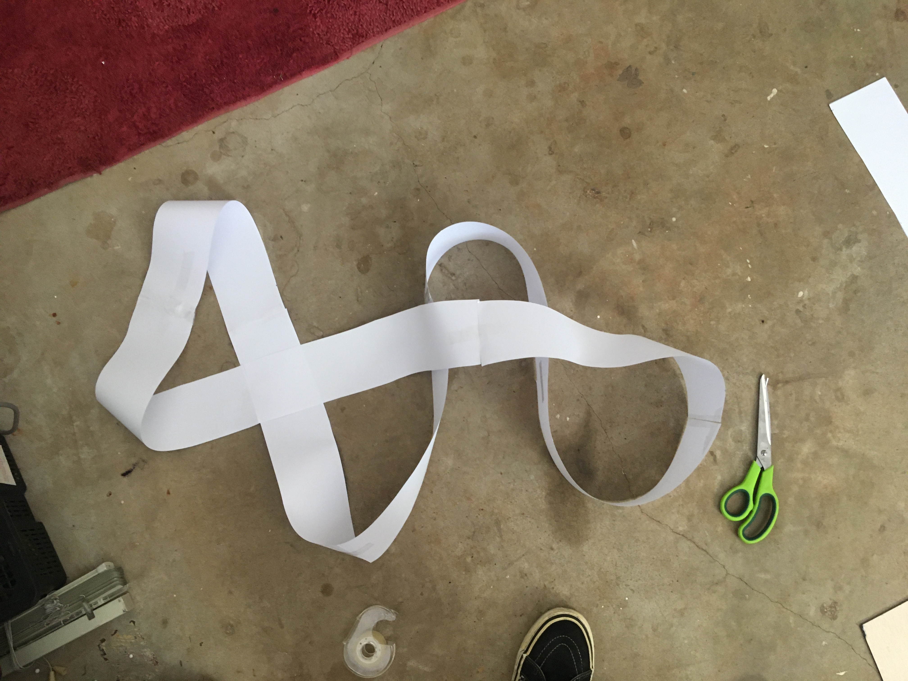

# 1701QCA Final project journal: *Insert your name here*

<!--- As for other assessments, fill out the following journal sections with information relevant to your project. --->

<!--- Markdown reference: https://guides.github.com/features/mastering-markdown/ --->

## Related projects ##
<!--- Find about 6 related projects to the project you choose. A project might be related through  function, technology, materials, fabrication, concept, or code. Don't forget to place an image of the related project in the appropriate folder and insert the filename in the appropriate places below. Copy the markdown block of code below for each project you are showing. --->
### Related project 1 ###
#### Giant LED sign for $15/foot ####
Project url:[https://blog.arduino.cc/2016/06/29/a-giant-arduino-powered-scrolling-led-sign-costs-15foot/](https://blog.arduino.cc/2016/06/29/a-giant-arduino-powered-scrolling-led-sign-costs-15foot/)

This project is related to mine because its lighting system is very similar to the intended lighting set up that I will use. This project uses eight WS2812/Neopixel LED light strips that are stacked vertically and programmed to display text, my implementation of this sign will use the microbits 5 high LED resolution and will be about a meter long compared to this project which is about 7 meters long.

### Related project 2 ###
#### Jenny Holzer####

[https://blog.arduino.cc/2016/06/29/a-giant-arduino-powered-scrolling-led-sign-costs-15foot/](https://blog.arduino.cc/2016/06/29/a-giant-arduino-powered-scrolling-led-sign-costs-15foot/)

This project is related to mine because it uses the 

### Related project 3 ###
#### Moving No.3 Sculpture by Wenqin Chen ####
[https://www.saatchiart.com/art/Sculpture-Moving-No-3/40932/7029683/view](https://www.saatchiart.com/art/Sculpture-Moving-No-3/40932/7029683/view)

This project is related to mine because of it is simmilar aesthetic apperence. The artwork by Wenqin has a form familiar to my own project. The Artist has also use a reflective material, this is something that is have considered myself as well.  

### Car Heads Up Display ###

<!--- Modify code to insert image of related project below --->

<!--- Fill out name and link to related project in the code below. --->
Related product
[Car Heads up display](https://www.kogan.com/au/buy/obdii-car-head-display/)
Related project 
[Car Heads up display arduino project ](https://lifehacker.com/how-to-build-a-heads-up-display-for-your-car-1129913775?IR=T)

<!--- Include information about why this project is related to yours. --->
The above projects are very simmilar to the functionality of the projected screen that is seen in my project. Neither of these links were use to inform the design but the insparation was drawn from the knowledge this reflection effect. 

### *Insert name of related project here* ###

<!--- Modify code to insert image of related project below --->

<!--- Fill out name and link to related project in the code below. --->
[Name of related project](https://[URL of related project])

<!--- Include information about why this project is related to yours. --->

<!--- Repeat code above for a total of 6 related projects --->

### *Insert name of related project here* ###

<!--- Modify code to insert image of related project below --->

<!--- Fill out name and link to related project in the code below. --->
[Name of related project](https://[URL of related project])

<!--- Include information about why this project is related to yours. --->

<!--- Repeat code above for a total of 6 related projects --->

## Other research ##
<!--- Include here any other relevant research you have done. This might include identifying readings, tutorials, videos, technical documents, or other resources that have been helpful. For each particular source, add a comment or two about why it is relevant or what you have taken from it. You should include a reference or link to each of these resources. --->

### Inspiration ###
* [https://projects.jennyholzer.com/LEDs](https://projects.jennyholzer.com/LEDs)
* Jenny Holzer - This project inspired both the Initial Final design and the Final desgn. 
* [https://www.ntticc.or.jp/en/exhibitions/2011/mikami-seiko-desire-of-codes/](https://www.ntticc.or.jp/en/exhibitions/2011/mikami-seiko-desire-of-codes/)
* Seiko Mikami - This project inspired the first design concept.
* [Cut EVA Foam hat](https://www.google.com.au/url?sa=i&url=http%3A%2F%2Fpromowarehouse.co.za%2Ffunky-ideas%2Ffoam-peaks%2F&psig=AOvVaw2XkQemUaGCVPzjc2saEU4J&ust=1589838865665000&source=images&cd=vfe&ved=0CAkQjhxqFwoTCLDImrvxu-kCFQAAAAAdAAAAABAK)
* This foam hat was an inspiration to the design of the paper covering that inclosed the Micro:bit. This spicific product did not inform the design but the knowledge of this design stlye did. 

### Functionality and Technical Research ###
#### Initial Final Concept ####
* [https://wp.josh.com/2016/05/20/huge-scrolling-arduino-led-sign/](https://wp.josh.com/2016/05/20/huge-scrolling-arduino-led-sign/)
* Josh Levine - Build blog of functional requirements of
* [https://core-electronics.com.au/5m-rgb-led-strip-ws2812-60-per-meter-black-strip-weatherproof.html](https://core-electronics.com.au/5m-rgb-led-strip-ws2812-60-per-meter-black-strip-weatherproof.html)
* Core electronics - to source parts and some tutorials 
[https://www.kitronik.co.uk/blog/distance-sensing-microbit-hc-sr04-module](https://www.kitronik.co.uk/blog/distance-sensing-microbit-hc-sr04-module)
* Micro:bit tutorial for the Ultrasonic distance sensor

#### Final Concept #### 
* [https://www.kitronik.co.uk/blog/distance-sensing-microbit-hc-sr04-module](https://www.kitronik.co.uk/blog/distance-sensing-microbit-hc-sr04-module)
* Micro:bit tutorial for the Ultrasonic distance sensor

## Conceptual development ##

### Design intent ###
<!--- Include your design intent here. It should be about a 10 word phrase/sentence. --->
Art installation that communicates ideas about living with technology.
### Design ideation ###
<!--- Document your ideation process. This will include the design concepts presented for assessment 2. You can copy and paste that information here. --->

### Design concept 1 ###
My first idea for an interactive that aligns with the design intent, was inspired by Seiko Mikami's *Desire of Codes* this interactive installation has a range of cameras that follow visitors recording them, this footage is projected onto a screen showing past and present visitors in a cool hexagonal visualization. My idea was to use the microbit to create a smart home device reminiscent of Google home/Alexa, the device would listen to people around it and then play back recording of what people have said around it. The device could even have some visual element to get people talking about it while they're nearby. 

One of the big dampeners on this idea is the limitations of the microbit. Its only a simple device with limited processing power and storage and has pretty limited functionality when it comes to audio. Due to the small storage size the melodies that it can play are short, only a few seconds and as fair as I am concerned there is no way to record sounds.
This combined with the intensive processing that would be required to trim audio clips and play them back puts the microbit in out of its depths. 

[Seiko Mikami's Desire of Codes](https://www.ntticc.or.jp/en/exhibitions/2011/mikami-seiko-desire-of-codes/)

### Design concept 2 ###
My second idea was focused around the infinite scroll user interface used by many of the most popular apps today. The human nature of how we are so easily captivated by this UI I find very interesting. From my own personal experience I've found my self captivated by a screen on many an odd occasion yet it is hard to resist; On the bus looking at the persons phone I front of me if I don't have my own, during a conversation even when I'm quite engaged in it, and when some ones instagram feed is in my field of view, all of these examples are just when I'm looking at others screens and not my own. So is it the swiping or the screen? This is an idea that I wanted to explore for the design intent. My idea to implement this would be screen similar to a phone with a similar UI to instagram of facebook however instead of showing a personalized catalog of images they would be random or stock images. The purpose would be to see how and if people would engage with just a random feed. Would people scroll? How long for? Other interesting ideas for this project could be placing it at a free charging station to see if people would use it to substitute their phone.

### *Initial* final design concept  ###
The final design concept is a sculpture that displays text on an LED screen and that text changes as a person approaches and it detected by the sculpture. The LED screen will be the focal point of the sculpture as it will display a range of text strings with different messages; one standard loop and one for when someone is detected to be in front of the sculpture.  The sculpture will be used to provoke interest and attract people to engage in the interaction. 

#### Functionality ####
The technical functionality will vary in complexity the electronic implementation should be quite simple with only a range of LED strips and a sensor to be connected to the micro bit however, the coding side of the project will be quite intensive. 
The following is a wiring diagram 

#### Fabrication ####
At the current stage of the project much of the fabrication is still to be worked out. My current thinking is to get a long sheet of flexible plastic and bend it into the figure 8 style shape the led screen can then be glued onto this. In the image further down of the paper prototype hanging up the sculpture is supported by string this will likely be use to hang the final project as well. The electronic componated will 
##### Material list #####
* 5m RGB addressable LED strip WS2812 60LEDs/meter 
* Electrical wire?
* Heat shrink tubing?
* Strip of flexible plastic?
* String
* Wood or other construction material(for hanging frame)

#### Aesthetics ####
The aesthetics of Jenny Holzers LEDS have been very inspirational in the conception of the project. With the first conception seeming quite reminiscent of some of her works. 
 
 The image above is a sketch of the original conception. The black text is the original imagining of how the project may look. The red text is the revision of the design having a smaller LED screen in the center of the sculpture.  This decision was made to shorten the LED screen after researching the materials to use. It was quickly discovered after a few measurements of a paper prototype that a lot of LEDs will be needed and that it would be quite expensive to have lights running around the whole sculpture. 
It was calculated that the prototype was 336cm long and I intend on using a 5 high LED resolution like the micro bit so this would need 15 meters of LED strips. After looking on the Neopixel website it was found that even buying the cheapest strips (30LEDS/meter) would cost a whole $300+ and this is not feasible, so cutting the LED screen down to 1 meter means this project can be more affordable with almost the same aesthetic effect.
 
The paper prototype is shown above this was made very simply and was used to estimate the LED cost as well as getting a feel for how the whole thing will look, feel and work.

#### Interaction ####
At the early stage of development when I considered interaction I was racking my head to think about how people could engage with this project as it was only text scrolling across the screen. I thought about the different triggers and interfaces that are available, starting with the ones that on board the microbit. However, I did not think of a suitable trigger in the inventors kit, I did think of using an ultrasonic distance sensor as it could detect people approaching the artwork to view it. At this point I had the epiphany to combine a LED strip of text with the figure 8 style shape and make it a sculpture. In incorporating the LED screen into the sculpture I believe people will be drawn into the artwork and will approach it for a closer look. This then can trigger the interaction of the text changing state. Testing, iterating and experimenting will be required to find out if the interaction will actually be carried out. Designing a range of signifiers to signal appropriate action may be required. 

### Changes and Why###
Breifly after the submitting of the Initial Design the next step was to start experimenting with materials for the loop and buy some other componates. As the initial design came together it was much an image in my head instead of a fully relised project, I also had not endovored into the fabrication very much. As a result of this when it came to buy all of the materials needed it was going to run up quite a bill. It was already know that the LEDs would be expensive but with all of the other needed meterial added(espesialy the plastic for the loop) it was not fesible to continue. At this point a couple of dissisions had to be made I already had a few backup ideas for recreating the interaction with just the microbit so I experimented a litle with mocking up these designs to get a feel for them. After doing this I desided on the new aesthetic form of the project and set about making this a reality.   

### Final design concept  ###
<!--- This should be a description of your concept including its context, motivation, or other relevant information you used to decide on this concept. --->
The concept of the final design is for a nest like sculpture with an opening at the front that people can bend down and look through, what they will see is text relevent to the theme of living with technology. The project is be best suited for the context of an art gallery or exibihtion as it quite delicate and is predominately designed for viewing. It also fits the installation/sculpture theme relevent to the design intent. One of the key motivations for the project was the ambition to create an engaging art peice, as this is an interest of mine. Another driving force behind the theme of the project is my interset in the relationship between people and there devices and technology. These days this relationship is both inescapeable and ubiquitous it intregs me. 

#### Functionality ####
The functional requirements for the project are quite basic and can be simlifyed to two key sections. 
Microbit requirements
* Recive sonar data from Ultrasonic
* Process logic (If 'reading' < 7 )
* Display text (Actually images to the M:B)
Power requirements 
* Power Microbit 
* Power Ultrasonic sensor

When combined the whole system should monitor if something is close to the sensor and trigger accordingly. 

#### Fabrication ####
As for fabrication I will start with what is known and create around this. Much of the fabrication of the project will be done by thinking through making and prototyping. From here the look of the project start to be built up as well. So what is known, the 5x5 microbit screen will show the text and the ultrasonic will be looking forward to sense people. The overall size of the project will be not bigger than an A4 sheet and most of the materials will be souce from what I alreay have. 

#### Aesthetics ####
There have been a few major influences in the aesthetic choices made the first being Jenny Holzer and her LED artworks these works utilaze LED strips of text in various forms to make a social comentary and communicate her message in an aestheic and powerful way. The idea of scrolling LED text and the unique look that comes with this will be adapted to be used in my project. As for the greater overall look of the project this has been formed from the idea presented in the image below.
 
This was the first imagining of this aesthetic form and it was scribbled down but, further ideas from this included; using intersecting loops of thin plastic or paper and creating a ball or oval shape.
From this a further inspiration was found, this was Ai Wei Wei's Birds Nest National stadium in Beijing. This stadium was designed by Ai Wei Wei and mimics a presicly weaved birds cage. The design also has a large whole in the top and is oval shaped simmilar to the design that I was going for. Ai's design will be used as an inspiration for the covering of my project and will hopefully resemble its aesthetics. 

#### Interaction ####
The interaction with the project will be very simmilar to the initial final design however with the project being considerably smaller the interaction will not be triggered untill the user is very close. Instead of reading a message from a far and having it change as you are closer the message will change as you bend down for a closer look. 

See - Interaction under Initial Final design for more.
### Interaction flowchart ###
<!--- Include an interaction flowchart of the interaction process in your project. Make sure you think about all the stages of interaction step-by-step. Also make sure that you consider actions a user might take that aren't what you intend in an ideal use case. Insert an image of it below. It might just be a photo of a hand-drawn sketch, not a carefully drawn digital diagram. It just needs to be legible. --->

## Process documentation ##
<!--- In this section, include text and images (and potentially links to video) that represent the development of your project including sources you've found (URLs and written references), choices you've made, sketches you've done, iterations completed, materials you've investigated, and code samples. Use the markdown reference for help in formatting the material.

This should have quite a lot of information! It will likely include most of the process documentation from assessment 2 which can be copied and pasted here.

Use subheadings to structure this information. See https://guides.github.com/features/mastering-markdown/ for details of how to insert subheadings.

There will likely by a dozen or so images of the project under construction. The images should help explain why you've made the choices you've made as well as what you have done. --->
#### Fabrication ####
The start of the fabrication stemed off of the desition to change the form of the project. The first call of action for this was to prototype the idea for the nest so that I could weight up how it will look compared to the loop design. 
 
#### Aesthetics ####

## Final code ##

<!--- Include here screenshots of the final code you used in the project if it is done with block coding. If you have used javascript, micropython, C, or other code, include it as text formatted as code using a series of three backticks ` before and after the code block. See https://guides.github.com/features/mastering-markdown/ for more information about that formatting. --->

## Design process discussion ##
<!--- Discuss your process used in this project, particularly with reference to aspects of the Double Diamond design methodology or other relevant design process. --->

## Reflection ##

<!--- Describe the parts of your project you felt were most successful and the parts that could have done with improvement, whether in terms of outcome, process, or understanding.

What techniques, approaches, skills, or information did you find useful from other sources (such as the related projects you identified earlier)?

What parts of your project do you feel are novel. This is IMPORTANT to help justify a key component of the assessment rubric.

What might be an interesting extension of this project? In what other contexts might this project be used? --->
